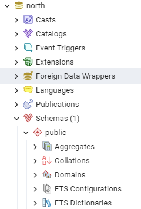
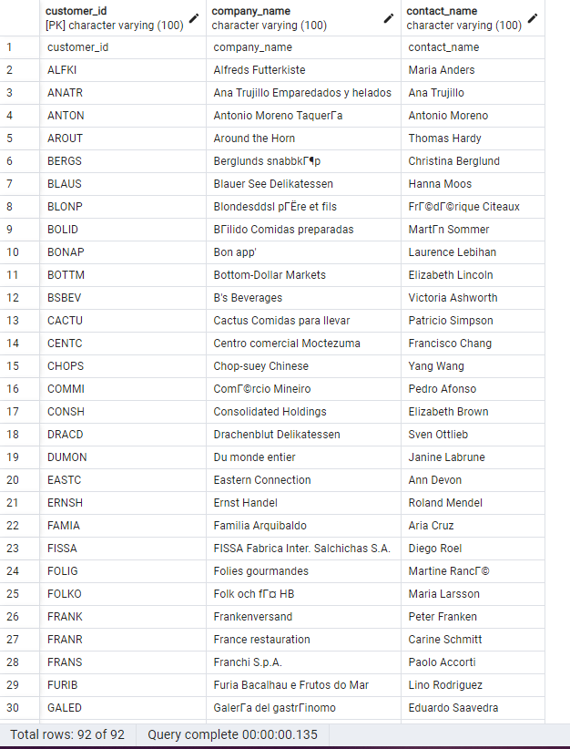
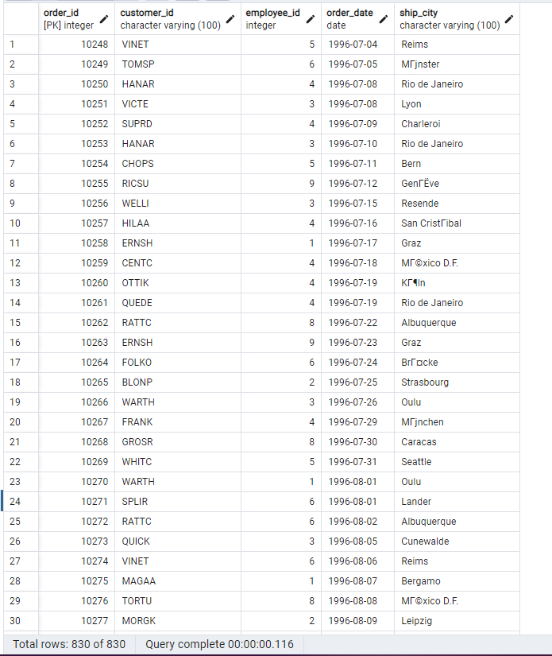

# Введение в БД. Домашнее задание

### Установка Postgres

### Создание БД

-Создал БД с названием north

### Создание таблиц

- Создал три таблицы в БД
    
- Колонки для таблиц создал в соответствии с таблицами из `north_data`
- Sql-код для создания таблиц скопировал в файл `create_tables.sql`

### Заполнение таблиц данными

- Написал скрипт в `main.py`, который заполнил созданные таблицы данными из `north_data`
- Все таблицы и их изменения присутствуют:

### В дополнение
Не знаю, нужно ли сюда импортировать данные из БД файлом, поэтому подтвердил всё скриншотами.
